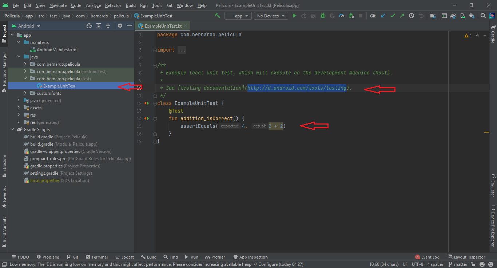

# Peliculas TMBD

- Para el buscador de peliculas, la API 4 no tiene documentacion para realizar busquedas, pero solo es cuestion de enviar una query mas al ENDPOINT 
- Utilize la version 4 para poder implementar el token en el Header

## Pendientes :
- Sobre las pruebas unitarias, se hacen en la seccion de test del cual Android Developer nos brinda su documentacion

    

